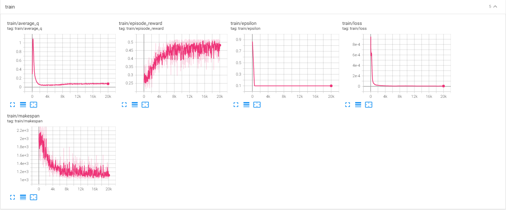
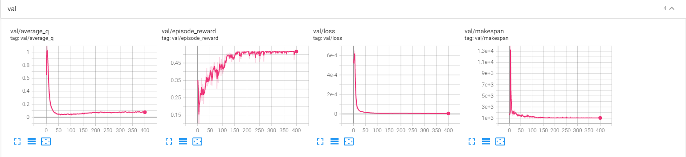

# JobSchedule
Implementation of paper "Research on Adaptive Job Shop Scheduling Problems Based on Dueling Double DQN" (论文复现)

# 运行
1. 依赖安装
```shell
pip3 install -r requirements.txt
```
2. 训练
```shell
python3 run_ddqn.py --output=../output_jobshop --dueling 
```
3. 测试
```shell
python3 run_ddqn.py --output=../output_jobshop --dueling --test
```
4. 测试并生成图片
```shell
python3 run_ddqn.py --output=../output_jobshop --dueling --test --render --mode=img 
```

# 论文中一些解释含糊地方的个人解释
## Observation 
该observation由3个channel组成, 包含: Processing time, Scheduling finish, 和 Machine Utilization. 
三者的行表示 job，列表示 operation (有的文章也叫 task). 结合图5和图11来看:
1. Processing time: 初始化为每个operation所需的执行时长, 运行过程中, 取哪个operation出来, 就将位置的值置为0
2. Scheduling finish: 该任务执行完成时的时刻, 赋值时需要判断该operation前一个完成时间和该operation对应机器完成时间哪个比较长，取长的那个
3. Machine Utilization: 记录每个机器的利用率，注意这里为每个cell赋值时，值为**该operation对应的机器的当前时间**，而不是该operation之前的完成时刻

## Reward
reward = 当前已完成所有operation的操作时间和/(机器数量*当前makespan)

# 一些疑问
1. 第10页中指的已知最佳策略 $\pi^{best}$ 是什么?
2. 第12页中 100\*20 和 84\*84 分别是什么意思?
3. 训练时是不是只用一个instance (比如ft06,la16等) 一直训?
4. 个人觉得，作者这里根据输入的大小会调整网络结构，不然比如ft06这个数据是无法使用图8所示的最佳网络结构的。虽然作者也从没给出任何一个详细完整的网络结构。

# 案例 la16 的训练过程展示
测试时最低makespan可得到1040左右 (似乎比论文中展示的效果还要好些)


